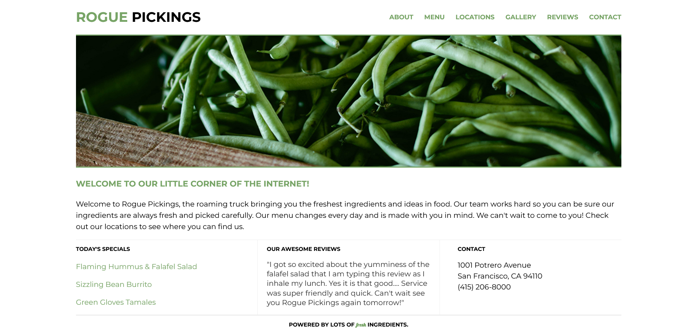

# Skillcrush project - Intro page for a small local

## Table of contents

- [Overview](#overview)
  - [The challenge](#the-challenge)
  - [Screenshot](#screenshot)
  - [Links](#links)
- [My process](#my-process)
  - [Built with](#built-with)
  - [What I learned](#what-i-learned)
  - [Continued development](#continued-development)
  - [Useful resources](#useful-resources)
- [Author](#author)

## Overview

### The challenge

Users should be able to:

- View the optimal layout for the site depending on their device's screen size
- (the initial requirement was to create a navigation bar but I added an additional stroke and hover state for the links)

### Screenshot



### Links
- Live Site URL: (https://doileo.github.io/rogue-pickings/)

## My process

### Built with

- Semantic HTML5 markup
- Flexbox
- Mobile-first workflow


### What I learned

In this project, I was able to gain some experience using Flexbox for the first time since I started the project.

It was very important to me that I made sure that I wrote the correct markup for the project. I also linked the stylesheet to it before I started the project.

Second, I wrote the basic styles for the project in order to get as close as possible to the styles required for the project without getting overboard.

Finally, I switched from mobile view to desktop view using media queries, which was the last thing I did.

Here are some code snippets:

```css
.container {
  max-width: 1200px;
  width: 90%;
  display: flex;
  justify-content: center;
  align-items: center;
  flex-flow: row wrap;
  padding-inline: 1.5rem;
}

.bottom-section {
  display: flex;
  justify-content: center;
  align-items: center;
  flex-flow: row wrap;
}
```

### Continued development

Some of the tricky things to use here was to use the flex-flow property and its value of row wrap. This is something I need to get used when using Flexblox in the projects.

### Useful resources

- [Resource 1](https://developer.mozilla.org/en-US/docs/Web/CSS/flex-flow) - I found this helpful for dealing with element wrapping.
- [Resource 2](https://developer.mozilla.org/en-US/docs/Web/CSS/CSS_Flexible_Box_Layout/Basic_Concepts_of_Flexbox) - This is an amazing article which helped  understand the basic concepts of Flexbox. I'd recommend it to anyone still learning this concept.

## Author

- Website - [Doina](https://doileo.github.io/portfolio/)
- LinkedIn - (https://www.linkedin.com/in/doinaleovchindeveloper/)


